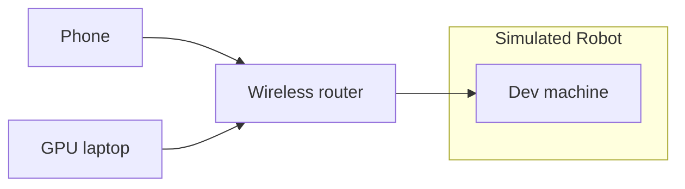
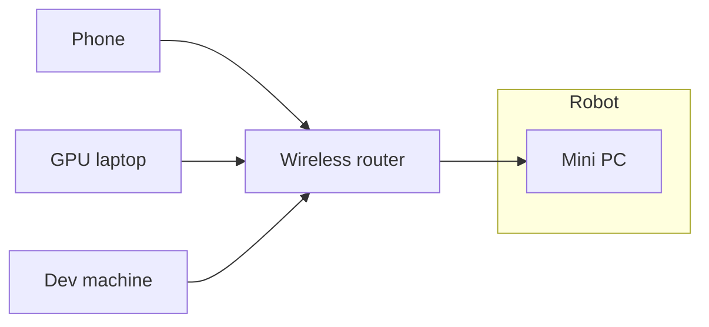

# tidybot2

This code release accompanies the following project:

### TidyBot++: An Open-Source Holonomic Mobile Manipulator for Robot Learning

Jimmy Wu, William Chong, Robert Holmberg, Aaditya Prasad, Yihuai Gao, Oussama Khatib, Shuran Song, Szymon Rusinkiewicz, Jeannette Bohg

*Conference on Robot Learning (CoRL)*, 2024

[Project Page](http://tidybot2.github.io) | [Paper](http://tidybot2.github.io/paper.pdf) | [arXiv](https://arxiv.org/abs/2412.10447) | [Assembly Guide](http://tidybot2.github.io/docs) | [Usage Guide](http://tidybot2.github.io/docs/usage) | [Video](https://youtu.be/6MH7dhyIUdQ)

**Abstract:** Exploiting the promise of recent advances in imitation learning for mobile manipulation will require the collection of large numbers of human-guided demonstrations. This paper proposes an open-source design for an inexpensive, robust, and flexible mobile manipulator that can support arbitrary arms, enabling a wide range of real-world household mobile manipulation tasks. Crucially, our design uses powered casters to enable the mobile base to be fully holonomic, able to control all planar degrees of freedom independently and simultaneously. This feature makes the base more maneuverable and simplifies many mobile manipulation tasks, eliminating the kinematic constraints that create complex and time-consuming motions in nonholonomic bases. We equip our robot with an intuitive mobile phone teleoperation interface to enable easy data acquisition for imitation learning. In our experiments, we use this interface to collect data and show that the resulting learned policies can successfully perform a variety of common household mobile manipulation tasks.

 |  | 
:---: | :---: | :---:
 |  | 

## Overview

This open-source release includes all components needed to fully reproduce our hardware and software setup:

* Hardware design
* Low-level controllers
* Phone teleoperation interface
* Policy training
* Policy inference

> [!TIP]
> If you are viewing this document on GitHub, click the ☰ icon in the top-right corner to open the "Outline" for easier navigation.

### Simulation

We provide a simulation environment that supports the entire policy learning pipeline, allowing you to easily try out our codebase without a physical robot.
To get started, please see the [Setup](#setup) and [Usage](#usage) sections below.

Our simulation setup uses the following system architecture:



### Real robot

To get started using this codebase with a physical robot for teleoperation and policy learning:

1. Follow the [Assembly guide](https://tidybot2.github.io/docs) to build the open-source robot.
1. Follow the [Setup](#setup) and [Usage](#usage) sections below to familiarize yourself with this codebase.
1. Follow the [Software](https://tidybot2.github.io/docs/software) docs page to set up the onboard mini PC.
1. Follow the [Usage guide](https://tidybot2.github.io/docs/usage) to operate the robot.

Our real robot setup uses the following system architecture:



> [!NOTE]
> When working with real robot hardware, it is important that the onboard mini PC (which runs the real-time robot controllers) is configured to minimize latencies.
> If there is jitter in the real-time control loop due to latency issues, you may encounter a variety of undesirable symptoms, such as:
>
> * Loud buzzing noises from the motors
> * Shaky arm movements and "following errors"
> * Highly inaccurate mobile base odometry
>
> If you plan to modify the system design or codebase, please keep the following recommendations in mind:
>
> * On the mini PC, run robot controllers with real-time process priority, and keep real-time processes lean. Avoid importing non-time-sensitive components (e.g., `import cv2`) into real-time processes, as this can cause unexpected latency spikes.
> * All heavy computation (e.g., deep learning, point cloud processing, etc.) should be run on a separate machine, such as a GPU laptop or workstation, to prevent interference with the real-time controllers.
> * To interface with our real-time controllers from external code, please use the provided RPC servers ([`BaseServer`](#base-rpc-server) and [`ArmServer`](#arm-rpc-server)), which run the controllers in isolated real-time processes. We do not recommend importing the controllers directly into external Python code.
> * Do not use Python's `Process` class to create real-time processes, as child processes will not be fully isolated from parent (non-real-time) processes.

## Setup

### Dev machine

Please install Mamba following the [official instructions](https://mamba.readthedocs.io/en/latest/installation/mamba-installation.html) (we use the Miniforge distribution).

Then run the following commands to set up the Mamba environment:

```bash
mamba create -n tidybot2 python=3.10.14
mamba activate tidybot2
pip install -r requirements.txt
```

### GPU laptop

The GPU laptop handles policy training and inference.
Please set up the [`diffusion_policy`](https://github.com/real-stanford/diffusion_policy) repo on the GPU laptop, including the `robodiff` Mamba environment.

> [!NOTE]
> We intentionally use separate Mamba environments (`tidybot2` and `robodiff`) for the different codebases, since they might have conflicting dependencies.

Next, clone this codebase (`tidybot2`) onto the GPU laptop:

```bash
git clone https://github.com/jimmyyhwu/tidybot2.git
```

If you have not used the `diffusion_policy` codebase before, we recommend validating your setup by starting a training run:

1. Download the `robomimic_image` dataset:

    ```bash
    cd ~/diffusion_policy
    mkdir data && cd data
    wget https://diffusion-policy.cs.columbia.edu/data/training/robomimic_image.zip
    unzip robomimic_image.zip && cd ..
    ```

1. Start a training run for the `square_image_abs` task:

    ```bash
    mamba activate robodiff
    python train.py --config-name=train_diffusion_unet_real_hybrid_workspace task=square_image_abs
    ```

    Confirm that the training run starts successfully.

## Usage

This section describes how to use each component of the policy learning pipeline with our simulation environment.
We provide sample data and pretrained weights so that you can easily run all commands.

### Phone teleoperation

To use our phone teleoperation system with the simulation, please see the [Phone teleoperation](https://tidybot2.github.io/docs/usage/#phone-teleoperation) section of the Usage guide, making sure that the "Simulation" tab is selected.

### Data collection

To collect data using our phone teleoperation interface, please see the [Data collection](https://tidybot2.github.io/docs/usage/#data-collection) section of the Usage guide.

After data has been collected, it can be helpful to validate the data by replaying episodes.
We will show how to do this using our sample data, which can be downloaded as follows:

1. Create the `data` directory:

    ```bash
    cd ~/tidybot2
    mkdir data
    ```

1. Download the sample data:

    ```bash
    wget -O data/sim-v1.tar.gz "https://www.dropbox.com/scl/fi/fsotfgbwg3m545jenj457/sim-v1.tar.gz?rlkey=lbkuq4fhg3pi1meci1kta41ny&dl=1"
    ```

1. Extract the data:

    ```bash
    tar -xf data/sim-v1.tar.gz -C data
    ```

Use the following command to load the simulation and replay episodes from the `data/sim-v1` directory:

```bash
python replay_episodes.py --sim --input-dir data/sim-v1
```

If you have your own data, please use `--input-dir` to specify its location (default is `data/demos`).

> [!NOTE]
> The task is to pick up the cube from the ground.
> Since the cube's initial pose is randomized, open-loop replay is not expected to succeed.

To visualize the images as well, add `--show-images`:

```bash
python replay_episodes.py --sim --input-dir data/sim-v1 --show-images
```

To execute proprioception observations as actions, add `--execute-obs`:

```bash
python replay_episodes.py --sim --input-dir data/sim-v1 --execute-obs
```

> [!NOTE]
> Real robot data can be replayed in simulation and vice versa, as the data format is identical.
> For example, the following command will replay our `sim-v1` data from simulation on the real robot:
>
> ```bash
> python replay_episodes.py --input-dir data/sim-v1
> ```

### Policy training

Before training a policy on collected data, you need to first convert the data into a format compatible with the `diffusion_policy` codebase:

1. Within the `tidybot2` repo, run the following command to load all episodes in `--input-dir`, transform them, and save the resulting `.hdf5` file to `--output-path`:

    ```bash
    python convert_to_robomimic_hdf5.py --input-dir data/sim-v1 --output-path data/sim-v1.hdf5
    ```

1. Use `scp` (or another transfer method) to copy the generated `.hdf5` file to the GPU laptop.

Next, go to the GPU laptop, and follow the steps below to train a diffusion policy using the sample `sim-v1` data.
(If you are using your own data, please replace all instances of `sim-v1` with the name of your task.)

1. Move the generated `.hdf5` file to the `data` directory in the `diffusion_policy` repo:

    ```bash
    mkdir ~/diffusion_policy/data
    mv sim-v1.hdf5 ~/diffusion_policy/data/
    ```

    If you do not have `sim-v1.hdf5`, you can download our copy:

    ```bash
    cd ~/diffusion_policy
    mkdir data
    wget -O data/sim-v1.hdf5 "https://www.dropbox.com/scl/fi/0lhco1tfoi7dxyjcsz1ok/sim-v1.hdf5?rlkey=4wyspmcr9xymvsy2s22t6girv&dl=1"
    ```

1. Copy and apply the [`diffusion-policy.patch`](diffusion-policy.patch) file from `tidybot2`:

    ```bash
    cp ~/tidybot2/diffusion-policy.patch ~/diffusion_policy/
    cd ~/diffusion_policy
    git checkout 548a52b  # Last tested commit
    git apply diffusion-policy.patch
    ```

    This patch applies minor modifications to the `diffusion_policy` codebase to make it compatible with our setup.

1. Open [`diffusion_policy/diffusion_policy/config/task/square_image_abs.yaml`](https://github.com/real-stanford/diffusion_policy/blob/548a52bbb105518058e27bf34dcf90bf6f73681a/diffusion_policy/config/task/square_image_abs.yaml) and change the `name` field to the name of your task:

    ```
    name: sim-v1
    ```

1. Start the training run:

    ```bash
    cd ~/diffusion_policy
    mamba activate robodiff
    python train.py --config-name=train_diffusion_unet_real_hybrid_workspace
    ```

### Policy inference

Follow these steps on the GPU laptop to start the policy inference server with our pretrained `sim-v1` policy:

1. Copy [`policy_server.py`](policy_server.py) from `tidybot2`:

    ```bash
    cp ~/tidybot2/policy_server.py ~/diffusion_policy/
    ```

1. Create a directory to store our pretrained checkpoint for the `sim-v1` task:

    ```bash
    cd ~/diffusion_policy
    mkdir -p data/outputs/2024.10.08/23.42.04_train_diffusion_unet_hybrid_sim-v1/checkpoints
    ```

1. Download the pretrained checkpoint:

    ```bash
    wget -O data/outputs/2024.10.08/23.42.04_train_diffusion_unet_hybrid_sim-v1/checkpoints/epoch=0500-train_loss=0.001.ckpt "https://www.dropbox.com/scl/fi/tpmnl1lh2tljxsnq3nnr9/epoch-0500-train_loss-0.001.ckpt?rlkey=44ou4zfhu2de5hjse3v670qos&dl=1"
    ```

1. Start the policy server:

    ```bash
    cd ~/diffusion_policy
    mamba activate robodiff
    python policy_server.py --ckpt-path data/outputs/2024.10.08/23.42.04_train_diffusion_unet_hybrid_sim-v1/checkpoints/epoch=0500-train_loss=0.001.ckpt
    ```

Once the policy server is running, please see the [Policy inference](https://tidybot2.github.io/docs/usage/#policy-inference) section of the Usage guide for instructions on running policy rollouts in the simulation.
Here is a video showing the expected behavior of the pretrained policy:

https://github.com/user-attachments/assets/edb917d6-955c-4a4d-9eae-8538af9ef754

## Codebase guide

This section provides a more detailed look at each component of the codebase, which can be useful if you want to extend our setup or use specific components independently.

### Simulation environment

This snippet demonstrates how to load the simulation environment on your dev machine and execute random actions:

```python
import time
import numpy as np
from constants import POLICY_CONTROL_PERIOD
from mujoco_env import MujocoEnv

env = MujocoEnv(show_images=True)
env.reset()
try:
    for _ in range(100):
        action = {
            'base_pose': 0.1 * np.random.rand(3) - 0.05,
            'arm_pos': 0.1 * np.random.rand(3) + np.array([0.55, 0.0, 0.4]),
            'arm_quat': np.random.rand(4),
            'gripper_pos': np.random.rand(1),
        }
        env.step(action)
        obs = env.get_obs()
        print([(k, v.shape) if v.ndim == 3 else (k, v) for (k, v) in obs.items()])
        time.sleep(POLICY_CONTROL_PERIOD)  # Note: Not precise
finally:
    env.close()
```

Here is a video showing what the simulation looks like:

https://github.com/user-attachments/assets/77a189dc-ebac-4f66-90e7-352664010cef

### Real environment

Follow these steps to run the real environment on the mini PC:

1. Start a `tmux` session with three windows.

1. In `tmux` window 1, run:

    ```bash
    python base_server.py
    ```

1. In `tmux` window 2, run:

    ```bash
    python arm_server.py
    ```

1. In `tmux` window 3, run this snippet to load the environment and execute random actions on the real robot:

    ```python
    import time
    import numpy as np
    from constants import POLICY_CONTROL_PERIOD
    from real_env import RealEnv

    env = RealEnv()
    env.reset()
    try:
        for _ in range(100):
            action = {
                'base_pose': 0.1 * np.random.rand(3) - 0.05,
                'arm_pos': 0.1 * np.random.rand(3) + np.array([0.55, 0.0, 0.4]),
                'arm_quat': np.random.rand(4),
                'gripper_pos': np.random.rand(1),
            }
            env.step(action)
            obs = env.get_obs()
            print([(k, v.shape) if v.ndim == 3 else (k, v) for (k, v) in obs.items()])
            time.sleep(POLICY_CONTROL_PERIOD)  # Note: Not precise
    finally:
        env.close()
    ```

> [!NOTE]
> The random actions above were tested on the Kinova Gen3 arm.
> If you are using a different arm, please adjust the values accordingly to prevent unintended movements.

### Phone teleoperation

This snippet demonstrates how to start the phone teleoperation system and print out the poses received from your phone:

```python
import time
import numpy as np
from constants import POLICY_CONTROL_PERIOD
from policies import TeleopPolicy

obs = {
    'base_pose': np.zeros(3),
    'arm_pos': np.zeros(3),
    'arm_quat': np.array([0.0, 0.0, 0.0, 1.0]),
    'gripper_pos': np.zeros(1),
    'base_image': np.zeros((640, 360, 3)),
    'wrist_image': np.zeros((640, 480, 3)),
}
policy = TeleopPolicy()
policy.reset()  # Wait for user to press "Start episode"
while True:
    action = policy.step(obs)
    print(action)
    time.sleep(POLICY_CONTROL_PERIOD)  # Note: Not precise
```

Here is some example output:

```
{'base_pose': array([0., 0., 0.]), 'arm_pos': array([ 0.00620849, -0.00456189, -0.00060466]), 'arm_quat': array([ 0.00290134,  0.00261548, -0.01444372,  0.99988805]), 'gripper_pos': array([0.])}
```

> [!NOTE]
> For instructions on connecting and operating the phone web app, please see the [Phone teleoperation](https://tidybot2.github.io/docs/usage/#phone-teleoperation) section of the Usage guide.

To visualize the poses in Mujoco, you can use this snippet:

```python
import mujoco
import mujoco.viewer
import numpy as np
from policies import TeleopPolicy

policy = TeleopPolicy()
policy.reset()  # Wait for user to press "Start episode"

xml = """
<mujoco>
  <asset>
    <texture type="2d" name="groundplane" builtin="checker" mark="edge" rgb1="0.2 0.3 0.4" rgb2="0.1 0.2 0.3"
      markrgb="0.8 0.8 0.8" width="300" height="300"/>
    <material name="groundplane" texture="groundplane" texrepeat="5 5"/>
  </asset>
  <worldbody>
    <light directional="true"/>
    <geom name="floor" size="0 0 .05" type="plane" material="groundplane"/>
    <body name="target" pos="0 0 .5" mocap="true">
      <geom type="box" size=".05 .05 .05" rgba=".6 .3 .3 .5"/>
    </body>
  </worldbody>
</mujoco>
"""
m = mujoco.MjModel.from_xml_string(xml)
d = mujoco.MjData(m)
mocap_id = m.body('target').mocapid[0]
with mujoco.viewer.launch_passive(m, d, show_left_ui=False, show_right_ui=False) as viewer:
    viewer.opt.frame = mujoco.mjtFrame.mjFRAME_BODY
    while viewer.is_running():
        mujoco.mj_step(m, d)
        obs = {
            'base_pose': np.zeros(3),
            'arm_pos': d.mocap_pos[mocap_id],
            'arm_quat': d.mocap_quat[mocap_id][[1, 2, 3, 0]],  # (w, x, y, z) -> (x, y, z, w)
            'gripper_pos': np.zeros(1),
        }
        action = policy.step(obs)
        if action == 'reset_env':
            break
        if isinstance(action, dict):
            d.mocap_pos[mocap_id] = action['arm_pos']
            d.mocap_quat[mocap_id] = action['arm_quat'][[3, 0, 1, 2]]  # (x, y, z, w) -> (w, x, y, z)
        viewer.sync()
```

Here is a video showing what the Mujoco pose visualization looks like:

https://github.com/user-attachments/assets/09ea135e-6a55-490a-a950-f29e46b0e44a

### Policy inference

#### Latency hiding

The `PolicyWrapper` class is a wrapper around diffusion policy that initiates the next inference step 200 ms in advance, ensuring that a new action sequence will be ready immediately after the current one is exhausted.
This hides the policy inference latency (115 ms on an "RTX 4080 Laptop" GPU), leading to smoother action execution.

We provide a `StubDiffusionPolicy` class which simulates inference latency by sleeping for 115 ms when `step()` is called.
To better understand how `PolicyWrapper` works, you can run the following snippet, which uses `StubDiffusionPolicy` in place of an actual diffusion policy:

```python
import time
from policy_server import StubDiffusionPolicy, PolicyWrapper
from policy_server import POLICY_CONTROL_PERIOD

policy = PolicyWrapper(StubDiffusionPolicy())
policy.reset()
for step_num in range(1, 101):
    action = policy.step(step_num)
    print(f'obs: {step_num}, action: {action}')
    time.sleep(POLICY_CONTROL_PERIOD)  # Note: Not precise
```

In the output, each action `i` should be paired with observation `i` from the same step.

> [!NOTE]
> If your inference latency is different from ours, please adjust `LATENCY_BUDGET` accordingly.
> We use 200 ms (`LATENCY_BUDGET = 0.2`) because our inference latency is 115 ms and actions are executed every 100 ms (10 Hz policy control frequency).
>
> To verify that `LATENCY_BUDGET` is set correctly, you can modify `time.sleep()` in `StubDiffusionPolicy` to match your own inference latency, then run the previous snippet again.
> Confirm that each action is still paired with the observation from the same step.

#### Policy server

Since policy inference and robot control run on separate machines, we use a [ZMQ](https://zeromq.org) server on the GPU laptop to host the policy and allow remote clients to run policy inference.
The client machine can be the dev machine (simulation) or the mini PC (real robot).

To demonstrate how to use the policy server, first start the server and create a connection between the client and server machines:

1. On the GPU laptop, start the policy server (which listens on port `5555`):

    ```bash
    cd ~/diffusion_policy
    mamba activate robodiff
    python policy_server.py --ckpt-path data/outputs/2024.10.08/23.42.04_train_diffusion_unet_hybrid_sim-v1/checkpoints/epoch=0500-train_loss=0.001.ckpt
    ```

    If you are not using our pretrained checkpoint, use `--ckpt-path` to specify your own path.

1. On the client machine, create an SSH tunnel to port `5555` of the GPU laptop:

    ```bash
    ssh -L 5555:localhost:5555 <gpu-laptop-hostname>
    ```

Then run this snippet on the client machine to connect to the ZMQ server and reset the policy:

```python
import zmq

context = zmq.Context()
socket = context.socket(zmq.REQ)
socket.connect(f'tcp://localhost:5555')
socket.send_pyobj({'reset': True})
```

You should see the policy server print a message indicating that the policy has been reset.

To run policy rollouts, we use the `RemotePolicy` class, which handles communication with the policy server.
The following snippet demonstrates how to create a `RemotePolicy` and query it for actions:

```python
import time
import numpy as np
from constants import POLICY_CONTROL_PERIOD
from policies import RemotePolicy

obs = {
    'base_pose': np.zeros(3),
    'arm_pos': np.zeros(3),
    'arm_quat': np.array([0.0, 0.0, 0.0, 1.0]),
    'gripper_pos': np.zeros(1),
    'base_image': np.zeros((640, 360, 3)),
    'wrist_image': np.zeros((640, 480, 3)),
}
policy = RemotePolicy()
policy.reset()  # Wait for user to press "Start episode"
while True:
    action = policy.step(obs)
    print(action)
    time.sleep(POLICY_CONTROL_PERIOD)  # Note: Not precise
```

> [!NOTE]
> During policy inference, `RemotePolicy` uses the phone as an enabling device.
> When running this snippet, make sure to connect your phone and use the teleoperation web app.

Here is an example action from the `RemotePolicy`:

```
{'base_pose': array([ 0.06448543, -0.00167737, -0.00415279], dtype=float32), 'arm_pos': array([ 0.29729894, -0.00270472, -0.12367474], dtype=float32), 'arm_quat': array([ 0.74949557,  0.5799937 , -0.07653876, -0.3098474 ], dtype=float32), 'gripper_pos': array([0.48724735], dtype=float32)}
```

### Base controller

Our mobile base controller is adapted from Bob Holmberg's [open-source controller](https://github.com/google/powered-caster-vehicle).

Below, we describe how to use both the RPC server (high-level interface) and the `Vehicle` class (low-level interface).
For most use cases, we recommend using the RPC server rather than importing the controller into external code.

#### Base RPC server

The RPC server runs the base controller as an isolated real-time process, and allows clients from external, non-real-time processes to easily interface with it.

Follow these steps on the mini PC to control the mobile base via the RPC server:

1. Start a `tmux` session with two windows.

1. In `tmux` window 1, start the RPC server:

    ```bash
    python base_server.py
    ```

1. In `tmux` window 2, run the following snippet to create an RPC proxy object and execute robot actions:

    ```python
    import time
    import numpy as np
    from base_server import BaseManager
    from constants import BASE_RPC_HOST, BASE_RPC_PORT, RPC_AUTHKEY
    from constants import POLICY_CONTROL_PERIOD

    manager = BaseManager(address=(BASE_RPC_HOST, BASE_RPC_PORT), authkey=RPC_AUTHKEY)
    manager.connect()
    base = manager.Base()
    try:
        base.reset()
        for i in range(75):
            base.execute_action({'base_pose': np.array([0.0, 0.0, min(1.0, i / 50) * 3.14])})
            print(base.get_state())
            time.sleep(POLICY_CONTROL_PERIOD)  # Note: Not precise
    finally:
        base.close()
    ```

#### Velocity control

This snippet demonstrates how to use the low-level interface to send local frame velocity commands $(\dot{x}, \dot{y}, \dot{\theta})$ to the mobile base:

```python
import time
import numpy as np
from base_controller import Vehicle
from constants import POLICY_CONTROL_PERIOD

vehicle = Vehicle(max_vel=(0.25, 0.25, 0.79))
vehicle.start_control()
try:
    for _ in range(50):
        vehicle.set_target_velocity(np.array([0.0, 0.0, 0.39]))
        print(f'Vehicle - x: {vehicle.x} dx: {vehicle.dx}')
        time.sleep(POLICY_CONTROL_PERIOD)  # Note: Not precise
finally:
    vehicle.stop_control()
```

> [!NOTE]
> Global frame velocity commands are also supported.

#### Position control

This snippet demonstrates how to use the low-level interface to send global frame position commands $(x, y, \theta)$ to the mobile base:

```python
import time
import numpy as np
from base_controller import Vehicle
from constants import POLICY_CONTROL_PERIOD

vehicle = Vehicle(max_vel=(0.25, 0.25, 0.79))
vehicle.start_control()
try:
    for _ in range(75):
        vehicle.set_target_position(np.array([0.0, 0.0, 3.14]))
        print(f'Vehicle - x: {vehicle.x} dx: {vehicle.dx}')
        time.sleep(POLICY_CONTROL_PERIOD)  # Note: Not precise
finally:
    vehicle.stop_control()
```

#### State visualization

It can be useful to visualize the position $(x, y, \theta)$ and velocity $(\dot{x}, \dot{y}, \dot{\theta})$ of the mobile base for debugging purposes.
We provide a script to render a live visualization on your dev machine.
Here is a video showing what the visualization looks like:

https://github.com/user-attachments/assets/59010124-f08f-44ca-82e0-9a96f0f02331

> [!NOTE]
> To avoid slowing down the control loop, this visualization feature is disabled by default.

Follow these steps to enable the state visualization:

1. Install [Redis](https://redis.io) on both the mini PC and your dev machine:

    ```bash
    sudo apt install redis
    ```

    Redis is used to stream state information from the mini PC to your dev machine.

1. On the mini PC, open [`base_controller.py`](base_controller.py) and uncomment the following lines:

    ```python
    import redis
    self.redis_client = redis.Redis()
    ```

    ```python
    self.redis_client.set(f'x', f'{self.x[0]} {self.x[1]} {self.x[2]}')
    self.redis_client.set(f'dx', f'{self.dx[0]} {self.dx[1]} {self.dx[2]}')
    ```

1. On the mini PC, start gamepad teleoperation to begin publishing state information to Redis:

    ```bash
    python gamepad_teleop.py
    ```

1. On your dev machine, create an SSH tunnel to port `6379` (for Redis) on the mini PC:

    ```bash
    ssh -L 6379:localhost:6379 <user>@<minipc-hostname>
    ```

1. On your dev machine, launch the visualization:

    ```bash
    python plot_base_state.py
    ```

1. Drive the robot around using gamepad teleoperation. The visualization should update in real time.

> [!NOTE]
> If no data is being received, follow these steps to connect to the Redis instance and investigate further:
> 1. Start the Redis command line interface (CLI):
>
>     ```bash
>     redis-cli
>     ```
>
> 1. In the CLI, verify that the following keys are present when you run `keys *`:
>
>     ```
>     127.0.0.1:6379> keys *
>     1) "dx"
>     2) "x"
>     3) "q"
>     4) "dq"
>     ```
>
> 1. Verify that the position returned by `get x` looks correct, and updates as the robot moves:
>
>     ```
>     127.0.0.1:6379> get x
>     "-5.443154261316781e-05 1.2006236924087986e-06 -0.0001785613016550766"
>     ```

### Arm controller

Our Kinova Gen3 controller is adapted from Cornell EmPRISE Lab's [open-source compliant controller](https://github.com/empriselab/gen3_compliant_controllers).

Below, we describe how to use both the RPC server (high-level interface) and the `TorqueControlledArm` class (low-level interface).
For most use cases, we recommend using the RPC server rather than importing the controller into external code.

#### Arm RPC server

The RPC server runs the arm controller as an isolated real-time process, and allows clients from external, non-real-time processes to easily interface with it.

Follow these steps on the mini PC to control the arm via the RPC server:

1. Start a `tmux` session with two windows.

1. In `tmux` window 1, start the RPC server:

    ```bash
    python arm_server.py
    ```

1. In `tmux` window 2, run the following snippet to create an RPC proxy object and execute robot actions:

    ```python
    import time
    import numpy as np
    from arm_server import ArmManager
    from constants import ARM_RPC_HOST, ARM_RPC_PORT, RPC_AUTHKEY
    from constants import POLICY_CONTROL_PERIOD

    manager = ArmManager(address=(ARM_RPC_HOST, ARM_RPC_PORT), authkey=RPC_AUTHKEY)
    manager.connect()
    arm = manager.Arm()
    try:
        arm.reset()
        for i in range(50):
            arm.execute_action({
                'arm_pos': np.array([0.135, 0.002, 0.211]),
                'arm_quat': np.array([0.706, 0.707, 0.029, 0.029]),
                'gripper_pos': np.zeros(1),
            })
            print(arm.get_state())
            time.sleep(POLICY_CONTROL_PERIOD)  # Note: Not precise
    finally:
        arm.close()
    ```

#### Gravity compensation

This snippet demonstrates how to use the low-level interface to run a simple gravity compensation controller by passing in `grav_comp_control_callback`:

```python
import time
from kinova import TorqueControlledArm, grav_comp_control_callback

arm = TorqueControlledArm()
try:
    arm.init_cyclic(grav_comp_control_callback)
    while arm.cyclic_running:
        time.sleep(0.01)
except KeyboardInterrupt:
    arm.stop_cyclic()
    arm.disconnect()
```

#### Joint compliance

This snippet demonstrates how to use the low-level interface to run the joint compliant controller and hold the arm in the "Retract" configuration:

```python
import queue
import threading
import time
from arm_controller import JointCompliantController, command_loop_retract, command_loop_circle
from kinova import TorqueControlledArm

arm = TorqueControlledArm()
command_queue = queue.Queue(1)
controller = JointCompliantController(command_queue)
stop_event = threading.Event()
thread = threading.Thread(target=command_loop_retract, args=(command_queue, stop_event), daemon=True)
thread.start()
arm.init_cyclic(controller.control_callback)
try:
    while arm.cyclic_running:
        time.sleep(0.01)
except KeyboardInterrupt:
    stop_event.set()
    thread.join()
    time.sleep(0.5)  # Wait for arm to stop moving
    arm.stop_cyclic()
    arm.disconnect()
```

The arm should exhibit joint-level compliance, which you can verify by gently pushing on the arm.

To move the arm in a circular path instead, replace `command_loop_retract` with `command_loop_circle`:

```python
thread = threading.Thread(target=command_loop_circle, args=(arm, command_queue, stop_event), daemon=True)
```

#### High-level commands

For convenience, the low-level interface also supports high-level commands such as `home()` and `close_gripper()`, as demonstrated in this code snippet:

```python
from kinova import TorqueControlledArm

arm = TorqueControlledArm()
arm.home()
arm.disconnect()
```

### Cameras

#### Logitech camera

This snippet demonstrates how to connect to the Logitech camera and capture an image:

```python
import cv2 as cv
from cameras import LogitechCamera
from constants import BASE_CAMERA_SERIAL

base_camera = LogitechCamera(BASE_CAMERA_SERIAL)
base_image = None
while base_image is None:
    base_image = base_camera.get_image()
cv.imwrite('base-image.jpg', cv.cvtColor(base_image, cv.COLOR_RGB2BGR))
base_camera.close()
```

#### Kinova camera

This snippet demonstrates how to connect to the Kinova wrist camera and capture an image:

```python
import cv2 as cv
from cameras import KinovaCamera

wrist_camera = KinovaCamera()
wrist_image = None
while wrist_image is None:
    wrist_image = wrist_camera.get_image()
cv.imwrite('wrist-image.jpg', cv.cvtColor(wrist_image, cv.COLOR_RGB2BGR))
wrist_camera.close()
```

> [!NOTE]
> Reading from the Kinova camera requires an OpenCV build with [GStreamer](https://gstreamer.freedesktop.org/documentation/installing/on-linux.html) support.
> Please refer to the [Software](https://tidybot2.github.io/docs/software) docs page for setup instructions.

## Citation

If you find this work useful for your research, please consider citing:

```
@inproceedings{wu2024tidybot,
  title = {TidyBot++: An Open-Source Holonomic Mobile Manipulator for Robot Learning},
  author = {Wu, Jimmy and Chong, William and Holmberg, Robert and Prasad, Aaditya and Gao, Yihuai and Khatib, Oussama and Song, Shuran and Rusinkiewicz, Szymon and Bohg, Jeannette},
  booktitle = {Conference on Robot Learning},
  year = {2024}
}
```
